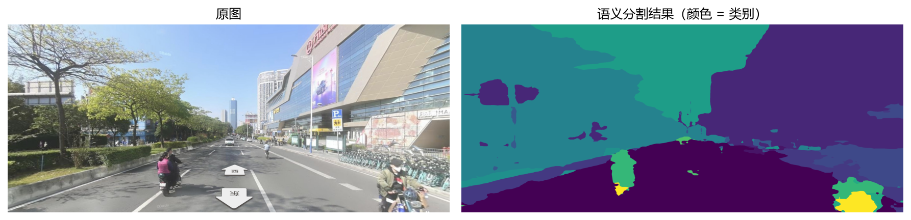
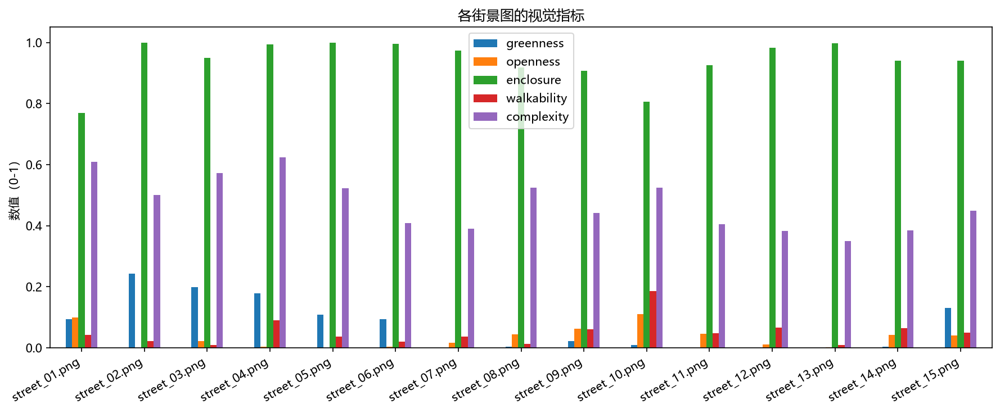
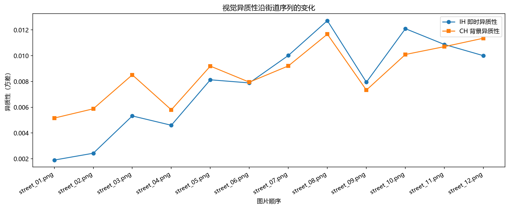

# Visual Heterogeneity of Street View Imagery — A Reproduction
# 街景图像的视觉异质性 —— 论文方法复现

A reproduction of the core methodology in:

> Yang, G., Su, Y., Zhao, M., **Li, C.**, & Wu, C. (2026). *Beyond single snapshots: Quantifying multi-scale heterogeneity from street-view imagery and what it reveals about perception.* **Cities**.

复现论文《Beyond single snapshots》(Cities, 2026) 的核心方法：把街景图像转成可计算的视觉指标，并量化其"视觉异质性"。

---

## Results / 结果

**Step 1 — Semantic segmentation of a street view image / 街景图的语义分割**



**Step 2 — Six visual indicators / 六个视觉指标**



**Step 3 — Visual heterogeneity along a street sequence / 沿街道序列的视觉异质性**



---

## What this project does / 项目做了什么

The pipeline has three steps, matching Sections 3.1–3.2 of the paper:

| Step | Script | What it does | 说明 |
|---|---|---|---|
| 1 | `step1_semantic_segmentation.py` | Segments a street view image into 19 Cityscapes classes using a pretrained SegFormer model | 用预训练模型把街景图分成 19 类 |
| 2 | `step2_visual_indicators.py` | Computes six visual indicators from the segmentation result | 从分割结果算六个视觉指标 |
| 3 | `step3_heterogeneity.py` | Computes visual heterogeneity (variance of indicators across neighboring scenes) | 计算视觉异质性（相邻场景指标的方差） |

### The six indicators / 六个指标

| Indicator | Definition | 定义 |
|---|---|---|
| Greenness | proportion of vegetation pixels | 植被像素占比 |
| Openness | proportion of sky pixels | 天空像素占比 |
| Enclosure | vertical elements / (vertical elements + sky) | 垂直元素 /（垂直元素 + 天空） |
| Walkability | (sidewalk + person) / (road + sidewalk) | 步行设施 / 道路面积 |
| Complexity | normalized Shannon entropy of the class distribution | 类别分布的归一化香农熵 |
| Color tone | dominant color from K-means | K-means 提取的主色 |

### Heterogeneity / 异质性

Following the paper's idea, heterogeneity = **the variance of the six indicators across neighboring scenes along a sequence**.

- **IH (Immediate Heterogeneity)** — fine-grained, immediate variation
- **CH (Contextual Heterogeneity)** — broader, neighborhood-scale variation

异质性 = 相邻场景在六个指标上的方差。IH 对应"眼前几步的变化"，CH 对应"一整片街区的多样性"。

---

## Repository structure / 目录结构

```
.
├── README.md
├── requirements.txt
├── check_image_quality.py     # quality check for input images
├── step1_semantic_segmentation.py
├── step2_visual_indicators.py
├── step3_heterogeneity.py
├── images/                    # input street view images
│   └── street_01.png ... street_12.png
└── outputs/                   # generated figures and tables
    ├── fig1_segmentation.png
    ├── fig2_indicators.png
    ├── fig3_heterogeneity.png
    ├── indicators.csv
    └── heterogeneity.csv
```

> The `images/` folder contains **12 street view images** captured along one street sequence in Guangzhou, named in walking order.
>
> `images/` 文件夹里是广州同一条街道的 **12 张街景图**，按行走顺序命名。

---

## Requirements / 环境要求

- Python 3.10+
- See `requirements.txt`

```bash
pip install -r requirements.txt
```

---

## How to run / 如何运行

**Step 1 — segment one image / 分割一张图**

```bash
python step1_semantic_segmentation.py
```

Output: `outputs/fig1_segmentation.png`

**Step 2 — compute indicators for all images in `images/` / 计算所有图片的指标**

```bash
python step2_visual_indicators.py
```

Output: `outputs/indicators.csv` and `outputs/fig2_indicators.png`

**Step 3 — compute heterogeneity (needs ≥ 4 images) / 计算异质性（至少需要 4 张图）**

```bash
python step3_heterogeneity.py
```

Output: `outputs/heterogeneity.csv` and `outputs/fig3_heterogeneity.png`

> Note: for Step 3, images should be named in walking order (e.g. `street_01.jpg`, `street_02.jpg`), because the script treats file order as the spatial sequence.
>
> 注意：第 3 步要求图片按"沿街行走顺序"命名。

---

## Method notes / 方法说明

- **Segmentation model**: `nvidia/segformer-b0-finetuned-cityscapes-1024-1024` (Cityscapes, 19 classes), used as a pretrained model — no training required.
- **Complexity**: computed as the Shannon entropy of the class distribution, normalized by `log(19)`.
- **Color tone**: dominant color obtained via K-means (k=3) on downsampled pixels.
- **Heterogeneity**: variance of indicators among neighboring scenes in the sequence.

---

## Simplified aspects / 简化的部分（如实说明）

This is a **partial and simplified** reproduction. Compared with the original paper:

| Aspect | Original paper | This reproduction |
|---|---|---|
| Data acquisition | OSM road network + Baidu Street View API (68,946 images) | manually collected street view images |
| Neighbor definition | 50 m / 500 m along the **road network** | order in the image sequence |
| Weighting | Shannon entropy weighting (per-indicator weights) | simple average |
| Perception data | 2M Weibo posts scored by LLM | not included |
| Validation | ML models (XGBoost etc.) + Moran's I | not included |

The reproduction focuses on **Sections 3.1–3.2** of the paper: extracting visual indicators and quantifying heterogeneity. The core idea — *heterogeneity as the variance of indicators across neighboring scenes* — is preserved.

本复现聚焦论文 3.1–3.2 节的核心部分：指标提取与异质性量化。数据采集、权重方法、感知分析与模型验证为简化或未包含的部分，已在上表如实列出。

---

## Reference / 参考文献

Yang, G., Su, Y., Zhao, M., Li, C., & Wu, C. (2026). Beyond single snapshots: Quantifying multi-scale heterogeneity from street-view imagery and what it reveals about perception. *Cities*. https://doi.org/10.1016/j.cities.2026.107227
